# 湖南大学本科毕业论文LaTeX模板（大理类）
本模板基于[Latex-HNUThesisTemplate](https://github.com/XayahSuSuSu/Latex-HNUThesisTemplate)，修复了以下格式 bug：
1. 封面：校名与校徽重叠、校徽与“论文（设计）题目”一行行距过大、“论文（设计）题目”需改用小二号黑体
2. 目录、插图索引、附表索引：点导引线密度与撰写规范样张不符
3. 表头：需改用五号黑体
4. 正文：章节标题与页眉垂直距离过大、无序列表与有序列表行距过大
5. 参考文献：文献间距过大、作者姓名未区分大小写（在 `.bib` 文件 author 字段给每个作者前后加上花括号，如：author = {Pinto Sandro and Santos Nuno} -> author = {{Pinto Sandro} and {Santos Nuno}}）

## 示例

  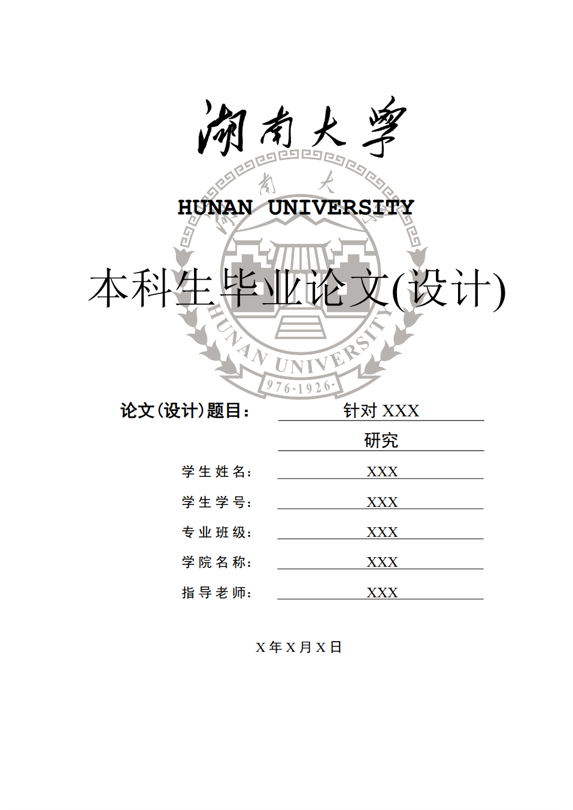
  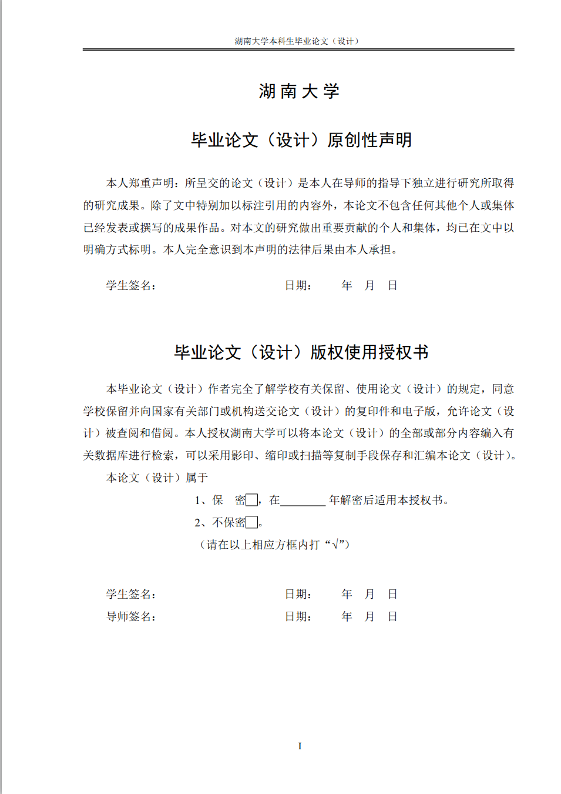

  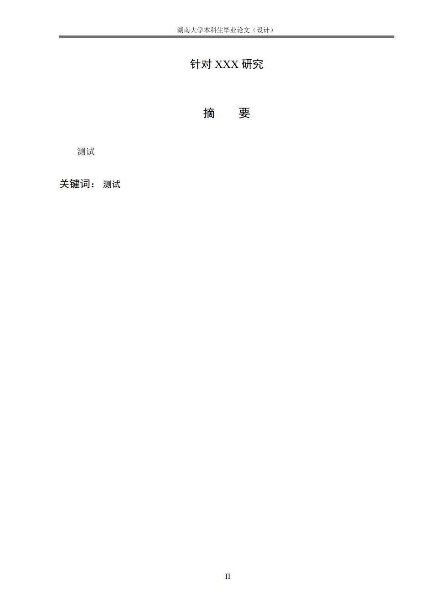
  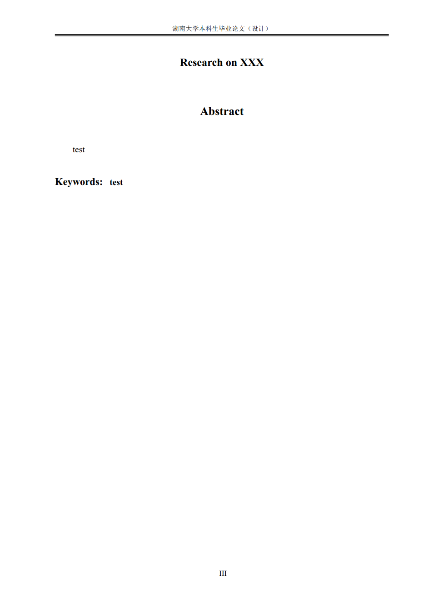

  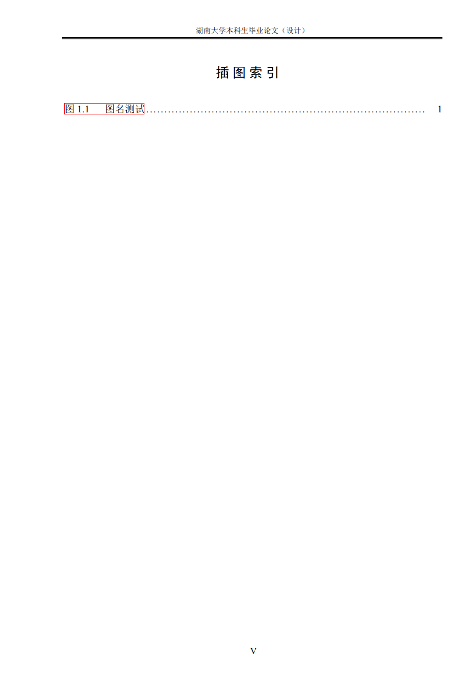
  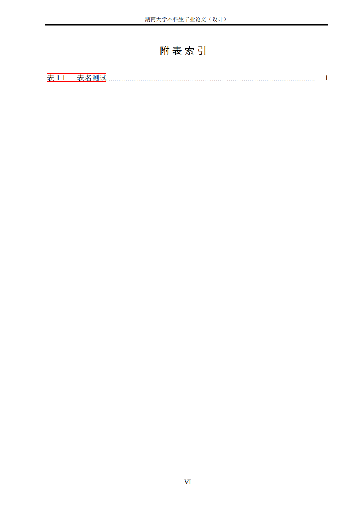

  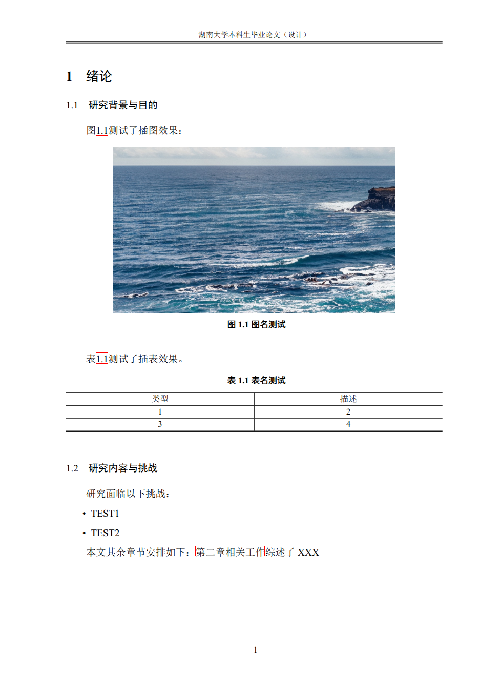
  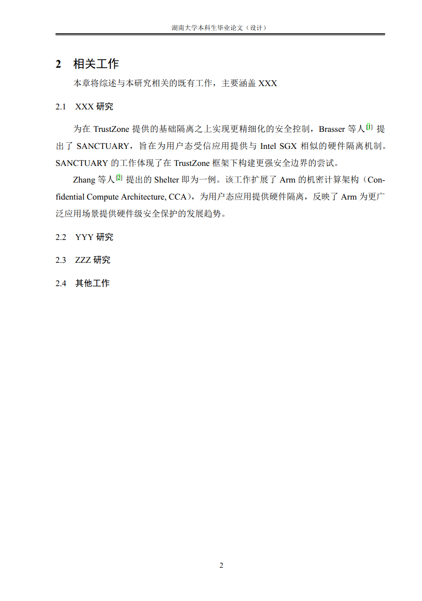

  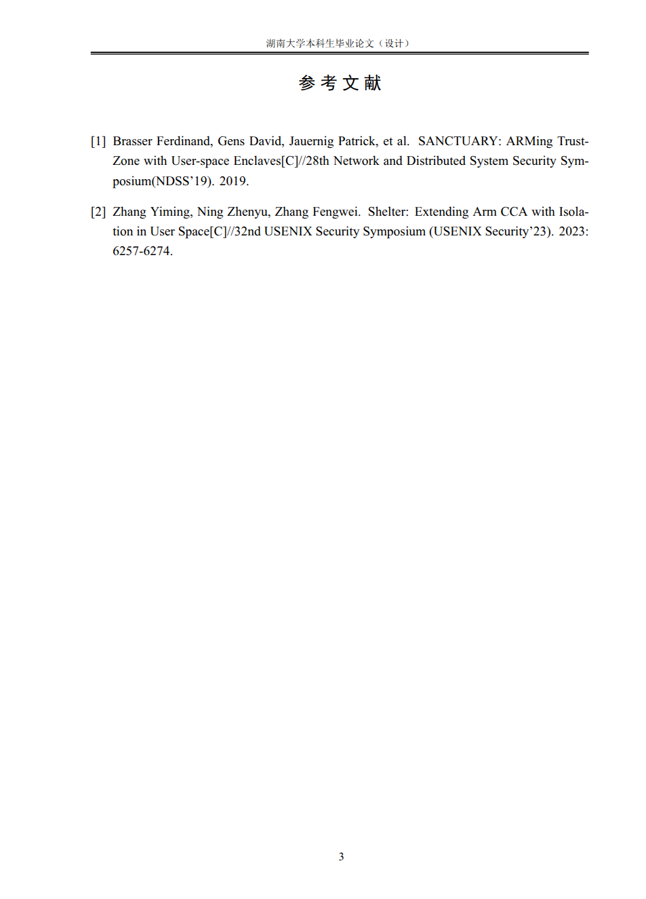
  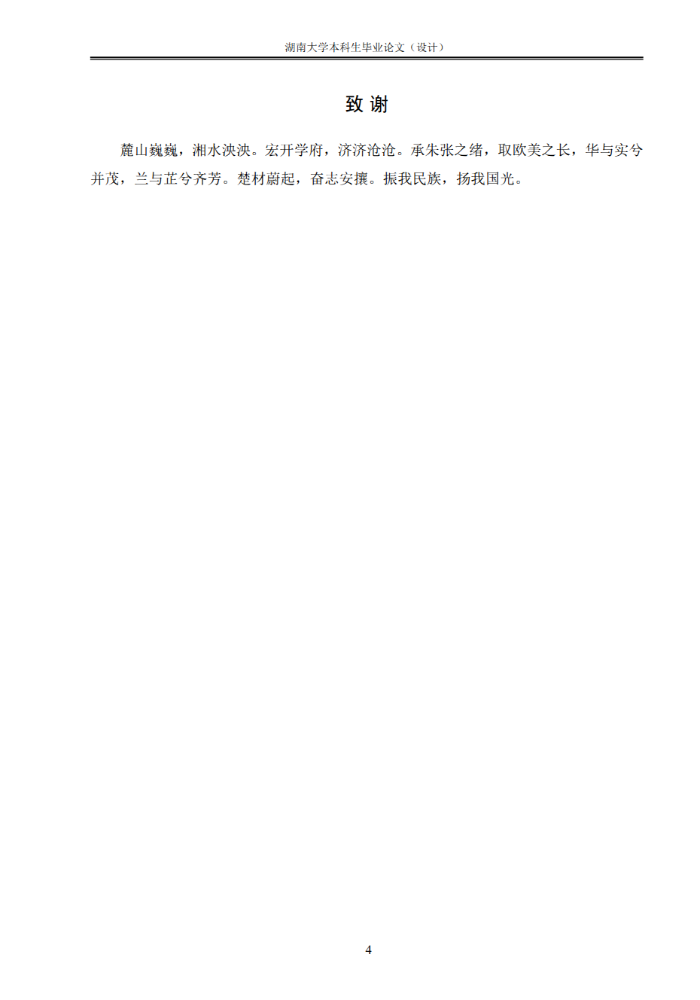

  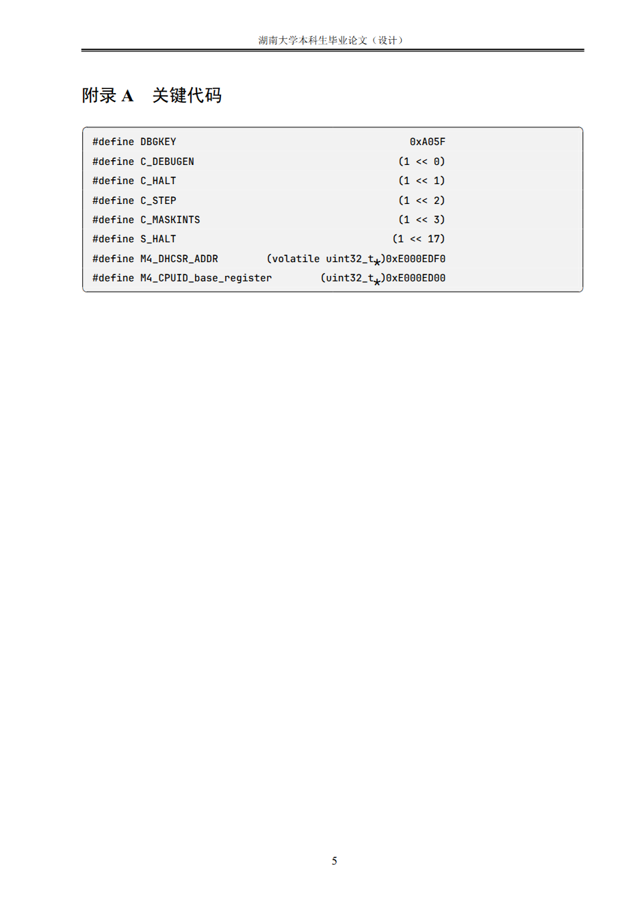

## 使用
### Overleaf（推荐）
1. 下载[Releases](https://github.com/955xiaoSu/Latex-HNUThesisTemplate-2025/releases)中的`Source.zip`
2. 登录至[Overleaf主页](https://www.overleaf.com/project)
3. 左侧**New Project - Upload Project**，导入下载的`zip`压缩包
4. 上传成功后会自动进入工程页面，点击左侧**Menu - Compiler**，选择`XeLaTeX`，重新编译即可。

## 说明
* 通常情况下只需要更改`src/docs/*`、`src/main.tex`、`src/main.tex`即可
* 详细内容请参考原模板：https://github.com/XayahSuSuSu/Latex-HNUThesisTemplate

## LICENSE
[Apache-2.0](./LICENSE)
